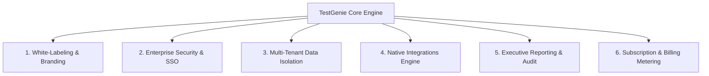

#  TestGenie Enterprise B2B SaaS Commercialization Roadmap

## Executive Summary
This document provides a comprehensive roadmap for transforming **TestGenie** from an internal QA generator into a commercial, multi-tenant B2B Enterprise SaaS application ready for licensing and white-labeling to third-party companies.

---

## 6 Core Pillars for B2B Commercial Readiness



---

### Pillar 1: White-Labeling & Theme Customization
To sell to enterprise clients, the application must completely decouple hardcoded branding and allow tenant-level white-labeling.

* **Tenant Branding Settings**:
  * Allow client Admins to upload company logos (`logo_url`) and set brand accent colors (`primary_hex`).
  * Replace static logo headers with `{tenant.companyName}` and CSS variables (`var(--brand-color)`).
* **Subdomain & CNAME Mapping**:
  * Support tenant subdomains (e.g. `acme.testgenie.io`) and custom CNAME DNS records (e.g., `qa.acmecorp.com`).
* **Onboarding & Setup Wizard**:
  * Replace preloaded mock user data (`Suresh Kumar`, `Priya Sharma`) with an automated First-Time Setup Wizard that guides new clients to create their initial project and invite team members.

---

### Pillar 2: Enterprise Authentication & Security (SSO / MFA)
Enterprise CISOs and Security teams require single sign-on and strict identity controls before approving software purchases.

* **Single Sign-On (SSO / SAML 2.0 / OAuth)**:
  * Integrate Okta, Azure AD (Entra ID), Google Workspace, and PingIdentity via Auth0, Clerk, or Supabase Auth.
* **Multi-Factor Authentication (MFA / 2FA)**:
  * Enforce TOTP authentication (Google Authenticator / Authy) for Admin and QA Lead roles.
* **Custom RBAC Matrix Builder**:
  * Replace hardcoded role checks with customizable permissions (e.g. create custom roles like *Contractor Tester* or *Auditor Plus*).

---

### Pillar 3: Multi-Tenancy Architecture & Data Isolation
Ensure strict physical or logical data segregation between companies to prevent cross-tenant data leaks.

* **Database Multi-Tenancy (`organization_id`)**:
  * Add `organization_id` foreign keys across all database tables (`projects`, `modules`, `test_cases`, `test_cycles`, `defects`, `users`).
  * Enforce Row-Level Security (RLS) policies:
    ```sql
    CREATE POLICY tenant_isolation_policy ON test_cases
    USING (organization_id = current_setting('app.current_organization_id'));
    ```
* **Storage Isolation**:
  * Store uploaded CSVs, attachments, and visual evidence screenshots in tenant-partitioned S3 buckets (`/tenants/{org_id}/attachments/`).

---

### Pillar 4: Ecosystem Integrations (Jira, Azure DevOps & CI/CD)
QA teams need TestGenie to integrate seamlessly with their existing development lifecycle tools.

* **Native Jira Cloud & Azure DevOps Integration**:
  * Replace mock Jira keys with real OAuth 2.0 app connections to Jira Cloud and Azure DevOps Boards.
  * Two-way Webhook Sync: Auto-update TestGenie cycle run status when Jira tickets transition to *Done* or *Closed*.
* **CI/CD Pipeline Triggers**:
  * Expose REST APIs and webhooks for **GitHub Actions**, **GitLab CI**, **Jenkins**, and **CircleCI** to trigger automated runs on pull requests.
* **Test Automation Framework Exporters**:
  * One-click exporter to convert manual 4-step test cases into executable **Playwright** (`.spec.ts`), **Cypress** (`.cy.js`), or **Selenium** scripts.

---

### Pillar 5: Executive Reporting, Analytics & Audit Logging
Provide C-level executives and auditors with actionable release readiness metrics and compliance documentation.

* **Executive PDF Exporter**:
  * One-click generation of publication-ready, branded PDF reports summarizing release pass rates, blocker defect breakdowns, and code coverage certificates for sign-off.
* **SOC 2 Compliant Audit Trail**:
  * Log all high-risk events (e.g., test case deletion, role modification, data exports, login attempts) with user IDs, timestamps, and IP addresses.
* **Data Retention & Purge Controls**:
  * Self-service functions for enterprise data retention policies and single-click tenant data export/purging.

---

### Pillar 6: Subscription Management, Metering & Monetization
Implement billing systems to manage plans, user seats, and usage thresholds.

* **Stripe Billing Integration**:
  * Implement standard B2B SaaS pricing tiers:
    * **Starter ($49/mo)**: Up to 5 user seats, 1,000 test cases, manual testing only.
    * **Professional ($199/mo)**: Up to 25 user seats, unlimited cases, Jira/DevOps integrations, CI/CD webhooks.
    * **Enterprise (Custom / $999+ / mo)**: Unlimited user seats, Custom SSO/SAML, Custom CNAME, SLA, On-premise options.
* **Usage Metering & Seat Management**:
  * Track active seat counts, storage limits, and API invocation quotas.

---

## 🛠️ Implementation Phases

| Phase | Focus Area | Key Deliverables | Timeline |
| :--- | :--- | :--- | :---: |
| **Phase 1** | **Branding & Auth Hardening** | Dynamic theme tokens, remove mock user defaults, integrate Auth0 / Clerk for SAML SSO. | Weeks 1 - 3 |
| **Phase 2** | **Multi-Tenancy & DB Integration** | Add `organization_id` RLS schemas, migrate local state to NestJS/PostgreSQL backend. | Weeks 4 - 6 |
| **Phase 3** | **Integrations & Billing** | Build real Jira OAuth integration, GitHub Actions webhooks, and Stripe billing checkout. | Weeks 7 - 9 |
| **Phase 4** | **Enterprise Security & Audit** | SOC 2 audit logging, Executive PDF generator, and tenant subdomain routing. | Weeks 10 - 12 |

---

## 💡 Quick Code Refactoring Checklist

1. **Decouple Preloaded Data**:
   Replace static default datasets with API fetch hooks scoped to the authenticated tenant.
2. **Dynamic CSS Branding**:
   Replace hardcoded color utilities (e.g. `bg-indigo-600`) with theme variables:
   ```css
   :root {
     --brand-primary: #4f46e5;
     --brand-secondary: #06b6d4;
   }
   ```
3. **API Authorization Middleware**:
   Wrap all API controller methods with tenant verification guards.
