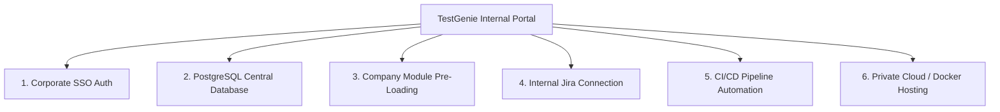

# 🏢 TestGenie Internal Enterprise Deployment Plan

## Executive Summary
This document outlines the architecture, setup steps, and recommended changes for deploying **TestGenie** as an **in-house, central Quality Assurance & Test Management Portal** for your organization.

---

## 🏛️ 6 Pillars for Internal Company Deployment

---

### Pillar 1: Corporate SSO Authentication
Connect TestGenie directly to your company's existing identity provider to eliminate manual account creation.

* **Google Workspace / Azure AD (Entra ID) / Okta Integration**:
  * Enable Single Sign-On (SSO) so employees sign in using their `@yourcompany.com` email address.
* **Automatic Role Mapping**:
  * Automatically assign roles based on corporate directory groups:
    * `Engineering-QA` group $\rightarrow$ **QA Engineer** / **QA Lead**
    * `Engineering-Dev` group $\rightarrow$ **Developer**
    * `Auditor` / `Management` group $\rightarrow$ **Auditor** (Read-Only)

---

### Pillar 2: Centralized Database Persistence (PostgreSQL)
Replace browser `localStorage` with your NestJS backend database (`test-genie-api`) so all team members collaborate on live, centralized data.

* **Database Connection**:
  * Connect frontend state to PostgreSQL via Prisma ORM (`test-genie-api`).
* **Real-Time Collaboration**:
  * Test case edits, execution runs, and status changes made by one QA engineer instantly update across all active team sessions.

---

### Pillar 3: Real Company Product Modules & Repositories
Pre-configure the portal with your company's actual software application modules.

* **Pre-Load Master Modules**:
  * Define core system modules (e.g., *Leaves & Holidays*, *Payroll Engine*, *Attendance & Time Tracking*, *Performance Management*).
* **Ingest Company Test Suites**:
  * Upload your existing `.csv`, `.xlsx`, or Zephyr Scale exports into TestGenie as the single source of truth.

---

### Pillar 4: Internal Jira & Issue Tracker Connection
Link TestGenie to your company's actual issue tracker.

* **Internal Jira API Token Connection**:
  * Connect TestGenie to `jira.yourcompany.com` or Jira Cloud via a Service Account API token.
* **Automated Bug Ticket Creation**:
  * When a tester clicks `FAILED 🛑` on an execution run, TestGenie automatically opens a ticket in your company's Jira project board and attaches failure logs and step details.

---

### Pillar 5: CI/CD Pipeline Integration (GitHub Actions / Jenkins)
Connect TestGenie to your software build and release pipeline.

* **Automated Execution Triggers**:
  * Configure GitHub Actions, GitLab CI, or Jenkins to send test result payloads to TestGenie's webhooks upon deployment.
* **Live Dashboard Telemetry**:
  * The internal dashboard automatically updates execution pass rates and trends after every staging/production release.

---

### Pillar 6: Private Deployment & Hosting
Deploy TestGenie safely within your company's private cloud network or internal servers.

* **Containerization (Docker)**:
  * Deploy using `docker-compose` or Kubernetes inside your company's AWS VPC, Azure, GCP, or on-premise servers.
* **HTTPS & SSL Security**:
  * Secure the portal under an internal domain like `https://qa.yourcompany.com` with SSL/TLS encryption.

---

## 🛠️ Step-by-Step Implementation Guide

| Step | Action Item | Target File / Component |
| :--- | :--- | :--- |
| **Step 1** | **Connect Frontend to Backend API** | Replace `localStorage` hooks in [App.tsx](file:///Users/bits-blr-bala/Documents/Testing_New_HRM/New_HRMS/test-genie/src/App.tsx) with API calls to `test-genie-api`. |
| **Step 2** | **Configure Corporate SSO** | Integrate Google/Azure AD OAuth client in [LoginGateway.tsx](file:///Users/bits-blr-bala/Documents/Testing_New_HRM/New_HRMS/test-genie/src/components/LoginGateway.tsx). |
| **Step 3** | **Pre-load Company Modules** | Update [default-data.ts](file:///Users/bits-blr-bala/Documents/Testing_New_HRM/New_HRMS/test-genie/src/engine/default-data.ts) with your company's real products. |
| **Step 4** | **Set Jira API Credentials** | Add your company Jira domain and API token in `test-genie-api/.env`. |
| **Step 5** | **Deploy via Docker** | Run `docker-compose up -d` on your internal QA server. |
